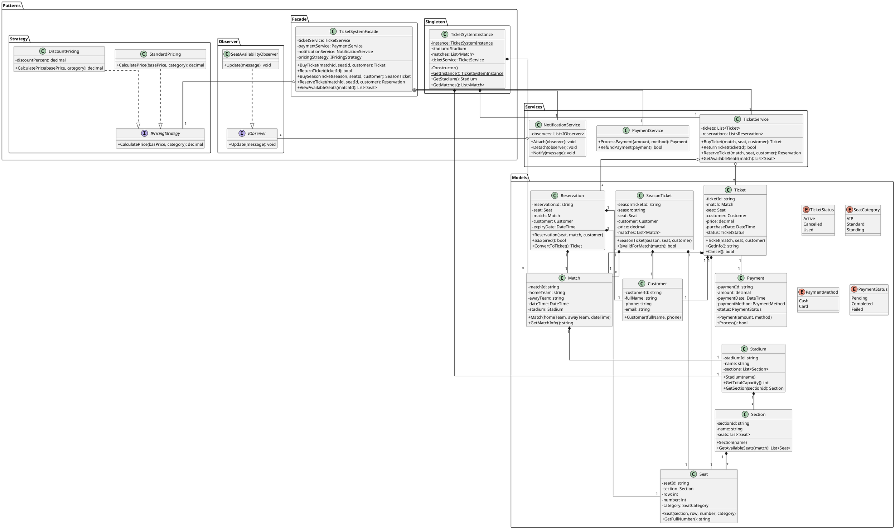

# Диаграмма классов

```plantuml
@startuml
skinparam classAttributeIconSize 0
skinparam linetype ortho

package "Models" {
  class Ticket {
    - ticketId: string
    - match: Match
    - seat: Seat
    - customer: Customer
    - price: decimal
    - purchaseDate: DateTime
    - status: TicketStatus
    + Ticket(match, seat, customer)
    + GetInfo(): string
    + Cancel(): bool
  }
  
  class SeasonTicket {
    - seasonTicketId: string
    - season: string
    - seat: Seat
    - customer: Customer
    - price: decimal
    - matches: List<Match>
    + SeasonTicket(season, seat, customer)
    + IsValidForMatch(match): bool
  }
  
  class Match {
    - matchId: string
    - homeTeam: string
    - awayTeam: string
    - dateTime: DateTime
    - stadium: Stadium
    + Match(homeTeam, awayTeam, dateTime)
    + GetMatchInfo(): string
  }
  
  class Seat {
    - seatId: string
    - section: Section
    - row: int
    - number: int
    - category: SeatCategory
    + Seat(section, row, number, category)
    + GetFullNumber(): string
  }
  
  class Stadium {
    - stadiumId: string
    - name: string
    - sections: List<Section>
    + Stadium(name)
    + GetTotalCapacity(): int
    + GetSection(sectionId): Section
  }
  
  class Section {
    - sectionId: string
    - name: string
    - seats: List<Seat>
    + Section(name)
    + GetAvailableSeats(match): List<Seat>
  }
  
  class Customer {
    - customerId: string
    - fullName: string
    - phone: string
    - email: string
    + Customer(fullName, phone)
  }
  
  class Payment {
    - paymentId: string
    - amount: decimal
    - paymentDate: DateTime
    - paymentMethod: PaymentMethod
    - status: PaymentStatus
    + Payment(amount, method)
    + Process(): bool
  }
  
  class Reservation {
    - reservationId: string
    - seat: Seat
    - match: Match
    - customer: Customer
    - expiryDate: DateTime
    + Reservation(seat, match, customer)
    + IsExpired(): bool
    + ConvertToTicket(): Ticket
  }
  
  enum TicketStatus {
    Active
    Cancelled
    Used
  }
  
  enum SeatCategory {
    VIP
    Standard
    Standing
  }
  
  enum PaymentMethod {
    Cash
    Card
  }
  
  enum PaymentStatus {
    Pending
    Completed
    Failed
  }
}

package "Services" {
  class TicketService {
    - tickets: List<Ticket>
    - reservations: List<Reservation>
    + BuyTicket(match, seat, customer): Ticket
    + ReturnTicket(ticketId): bool
    + ReserveTicket(match, seat, customer): Reservation
    + GetAvailableSeats(match): List<Seat>
  }
  
  class PaymentService {
    + ProcessPayment(amount, method): Payment
    + RefundPayment(payment): bool
  }
  
  class NotificationService {
    - observers: List<IObserver>
    + Attach(observer): void
    + Detach(observer): void
    + Notify(message): void
  }
}

package "Patterns.Singleton" {
  class TicketSystemInstance {
    - {static} instance: TicketSystemInstance
    - stadium: Stadium
    - matches: List<Match>
    - ticketService: TicketService
    - Constructor()
    + {static} GetInstance(): TicketSystemInstance
    + GetStadium(): Stadium
    + GetMatches(): List<Match>
  }
}

package "Patterns.Strategy" {
  interface IPricingStrategy {
    + CalculatePrice(basPrice, category): decimal
  }
  
  class StandardPricing {
    + CalculatePrice(basePrice, category): decimal
  }
  
  class DiscountPricing {
    - discountPercent: decimal
    + CalculatePrice(basePrice, category): decimal
  }
}

package "Patterns.Observer" {
  interface IObserver {
    + Update(message): void
  }
  
  class SeatAvailabilityObserver {
    + Update(message): void
  }
}

package "Patterns.Facade" {
  class TicketSystemFacade {
    - ticketService: TicketService
    - paymentService: PaymentService
    - notificationService: NotificationService
    - pricingStrategy: IPricingStrategy
    + BuyTicket(matchId, seatId, customer): Ticket
    + ReturnTicket(ticketId): bool
    + BuySeasonTicket(season, seatId, customer): SeasonTicket
    + ReserveTicket(matchId, seatId, customer): Reservation
    + ViewAvailableSeats(matchId): List<Seat>
  }
}

' Relationships
Ticket "1" *-- "1" Match
Ticket "1" *-- "1" Seat
Ticket "1" *-- "1" Customer
Ticket "1" -- "1" Payment

SeasonTicket "1" *-- "1" Seat
SeasonTicket "1" *-- "1" Customer
SeasonTicket "1" *-- "*" Match

Match "1" *-- "1" Stadium

Stadium "1" *-- "*" Section
Section "1" *-- "*" Seat

Reservation "1" *-- "1" Seat
Reservation "1" *-- "1" Match
Reservation "1" *-- "1" Customer

TicketService o-- "*" Ticket
TicketService o-- "*" Reservation

TicketSystemInstance *-- "1" Stadium
TicketSystemInstance *-- "*" Match
TicketSystemInstance *-- "1" TicketService

TicketSystemFacade o-- "1" TicketService
TicketSystemFacade o-- "1" PaymentService
TicketSystemFacade o-- "1" NotificationService
TicketSystemFacade o-- "1" IPricingStrategy

StandardPricing ..|> IPricingStrategy
DiscountPricing ..|> IPricingStrategy

SeatAvailabilityObserver ..|> IObserver
NotificationService o-- "*" IObserver

@enduml
```
