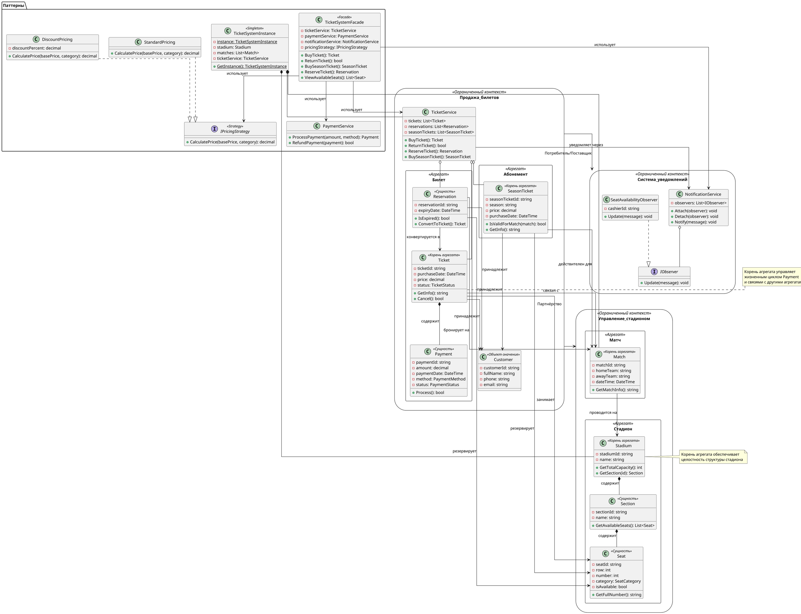

# Диаграмма классов

```plantuml
@startuml
scale 1.5
skinparam linetype ortho

!define BOUNDED_CONTEXT(name) rectangle name <<Ограниченный контекст>>
!define AGGREGATE(name) rectangle name <<Агрегат>>

skinparam <<Ограниченный контекст>>{
    roundcorner 80
    BackgroundColor #F0F8FF
}

skinparam <<Агрегат>>{
    BackgroundColor #FFF8DC
}

BOUNDED_CONTEXT("Продажа_билетов") as TicketContext {
    
    AGGREGATE("Билет") {
        class Ticket <<Корень агрегата>> {
            - ticketId: string
            - purchaseDate: DateTime
            - price: decimal
            - status: TicketStatus
            + GetInfo(): string
            + Cancel(): bool
        }
        
        class Reservation <<Сущность>> {
            - reservationId: string
            - expiryDate: DateTime
            + IsExpired(): bool
            + ConvertToTicket(): Ticket
        }
        
        class Payment <<Сущность>> {
            - paymentId: string
            - amount: decimal
            - paymentDate: DateTime
            - method: PaymentMethod
            - status: PaymentStatus
            + Process(): bool
        }
        
        Ticket *-- Payment : содержит
        Reservation --> Ticket : конвертируется в
    }
    
    AGGREGATE("Абонемент") {
        class SeasonTicket <<Корень агрегата>> {
            - seasonTicketId: string
            - season: string
            - price: decimal
            - purchaseDate: DateTime
            + IsValidForMatch(match): bool
            + GetInfo(): string
        }
    }
    
    class Customer <<Объект-значение>> {
        - customerId: string
        - fullName: string
        - phone: string
        - email: string
    }
    
    class TicketService {
        - tickets: List<Ticket>
        - reservations: List<Reservation>
        - seasonTickets: List<SeasonTicket>
        + BuyTicket(): Ticket
        + ReturnTicket(): bool
        + ReserveTicket(): Reservation
        + BuySeasonTicket(): SeasonTicket
    }
    
    Ticket --> Customer : принадлежит
    SeasonTicket --> Customer : принадлежит
    Reservation --> Customer : принадлежит
    TicketService o-- Ticket
    TicketService o-- Reservation
    TicketService o-- SeasonTicket
}

BOUNDED_CONTEXT("Управление_стадионом") as StadiumContext {
    
    AGGREGATE("Стадион") {
        class Stadium <<Корень агрегата>> {
            - stadiumId: string
            - name: string
            + GetTotalCapacity(): int
            + GetSection(id): Section
        }
        
        class Section <<Сущность>> {
            - sectionId: string
            - name: string
            + GetAvailableSeats(): List<Seat>
        }
        
        class Seat <<Сущность>> {
            - seatId: string
            - row: int
            - number: int
            - category: SeatCategory
            - isAvailable: bool
            + GetFullNumber(): string
        }
        
        Stadium *-- Section : содержит
        Section *-- Seat : содержит
    }
    
    AGGREGATE("Матч") {
        class Match <<Корень агрегата>> {
            - matchId: string
            - homeTeam: string
            - awayTeam: string
            - dateTime: DateTime
            + GetMatchInfo(): string
        }
    }
    
    Match --> Stadium : проводится на
}

BOUNDED_CONTEXT("Система_уведомлений") as NotificationContext {
    
    class NotificationService {
        - observers: List<IObserver>
        + Attach(observer): void
        + Detach(observer): void
        + Notify(message): void
    }
    
    interface IObserver {
        + Update(message): void
    }
    
    class SeatAvailabilityObserver {
        - cashierId: string
        + Update(message): void
    }
    
    SeatAvailabilityObserver ..|> IObserver
    NotificationService o-- IObserver
}

package "Паттерны" {
    
    class TicketSystemInstance <<Singleton>> {
        - {static} instance: TicketSystemInstance
        - stadium: Stadium
        - matches: List<Match>
        - ticketService: TicketService
        + {static} GetInstance(): TicketSystemInstance
    }
    
    interface IPricingStrategy <<Strategy>> {
        + CalculatePrice(basePrice, category): decimal
    }
    
    class StandardPricing {
        + CalculatePrice(basePrice, category): decimal
    }
    
    class DiscountPricing {
        - discountPercent: decimal
        + CalculatePrice(basePrice, category): decimal
    }
    
    StandardPricing ..|> IPricingStrategy
    DiscountPricing ..|> IPricingStrategy
    
    class TicketSystemFacade <<Facade>> {
        - ticketService: TicketService
        - paymentService: PaymentService
        - notificationService: NotificationService
        - pricingStrategy: IPricingStrategy
        + BuyTicket(): Ticket
        + ReturnTicket(): bool
        + BuySeasonTicket(): SeasonTicket
        + ReserveTicket(): Reservation
        + ViewAvailableSeats(): List<Seat>
    }
    
    class PaymentService {
        + ProcessPayment(amount, method): Payment
        + RefundPayment(payment): bool
    }
}

' Связи между контекстами
Ticket --> Match : связан с
Ticket --> Seat : занимает
SeasonTicket --> Seat : резервирует
SeasonTicket --> Match : действителен для
Reservation --> Match : бронирует на
Reservation --> Seat : резервирует

TicketSystemInstance *-- Stadium
TicketSystemInstance *-- Match
TicketSystemInstance *-- TicketService

TicketSystemFacade --> TicketService : использует
TicketSystemFacade --> PaymentService : использует
TicketSystemFacade --> NotificationService : использует
TicketSystemFacade --> IPricingStrategy : использует

TicketService --> NotificationService : уведомляет через

TicketContext --> StadiumContext : Партнёрство
TicketContext --> NotificationContext : Потребитель/Поставщик

note right of Ticket
  Корень агрегата управляет
  жизненным циклом Payment
  и связями с другими агрегатами
end note

note right of Stadium
  Корень агрегата обеспечивает
  целостность структуры стадиона
end note

@enduml
```
