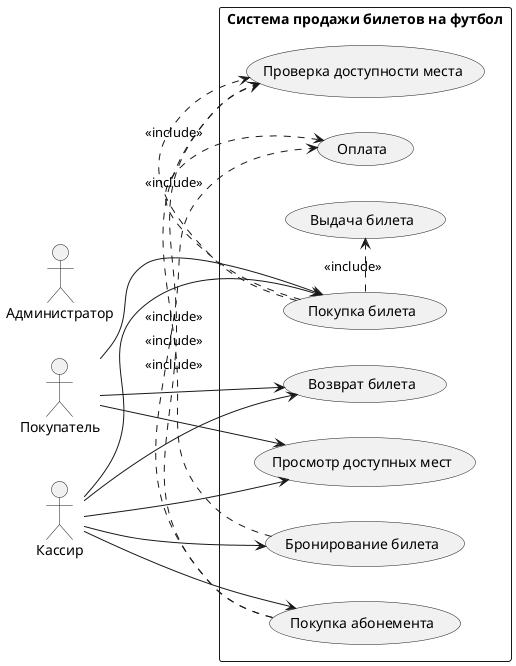

# Диаграмма прецедентов

```plantuml
@startuml
left to right direction
skinparam packageStyle rectangle

actor "Кассир" as Cashier
actor "Покупатель" as Customer
actor "Администратор" as Admin

rectangle "Система продажи билетов на футбол" {
  usecase "Покупка билета" as UC1
  usecase "Возврат билета" as UC2
  usecase "Покупка абонемента" as UC3
  usecase "Бронирование билета" as UC4
  usecase "Просмотр доступных мест" as UC5
  usecase "Оплата" as UC_Pay
  usecase "Проверка доступности места" as UC_Check
  usecase "Выдача билета" as UC_Issue
  
  Cashier --> UC1
  Cashier --> UC2
  Cashier --> UC3
  Cashier --> UC4
  Cashier --> UC5
  
  Customer --> UC1
  Customer --> UC2
  Customer --> UC5
  
  UC1 .> UC_Pay : <<include>>
  UC1 .> UC_Check : <<include>>
  UC1 .> UC_Issue : <<include>>
  
  UC3 .> UC_Pay : <<include>>
  UC3 .> UC_Check : <<include>>
  
  UC4 .> UC_Check : <<include>>
}

@enduml
```
