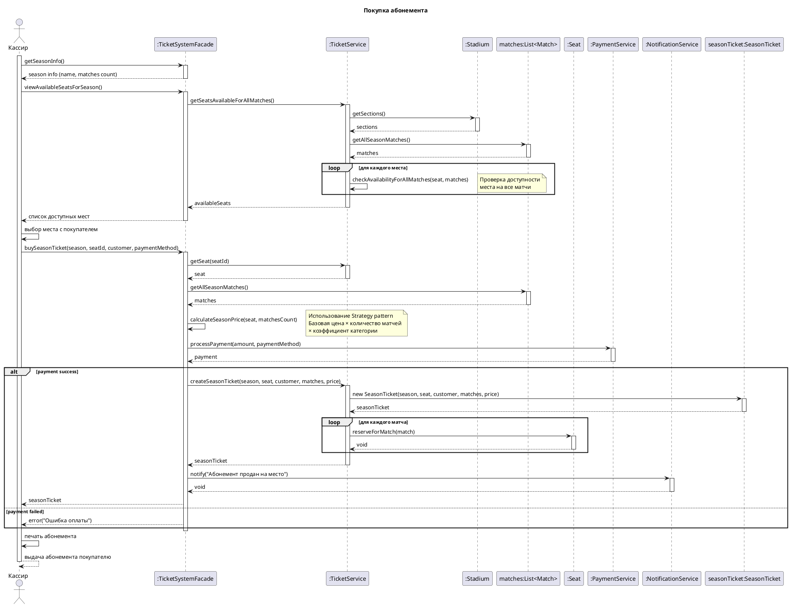

# Диаграмма последовательности: Покупка абонемента


```

### Коммит изменений

```bash
git add "docs/Прецеденты/Покупка абонемента/"
git commit -m "Add use case: Buy Season Ticket"
git push origin main

