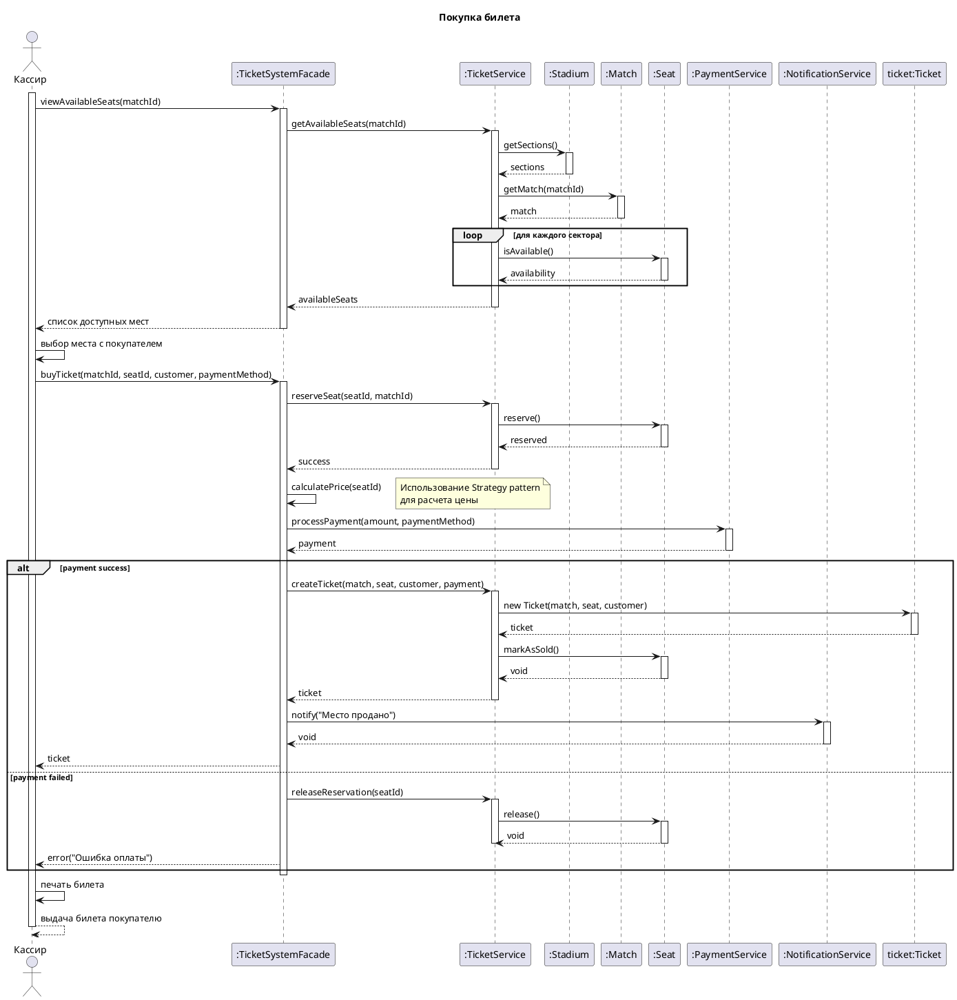

# Диаграмма последовательности: Покупка билета

```plantuml
@startuml
title Покупка билета

actor "Кассир" as Cashier
participant ":TicketSystemFacade" as Facade
participant ":TicketService" as Service
participant ":Stadium" as Stadium
participant ":Match" as Match
participant ":Seat" as Seat
participant ":PaymentService" as PaymentSvc
participant ":NotificationService" as NotifSvc
participant "ticket:Ticket" as Ticket

activate Cashier
Cashier -> Facade: viewAvailableSeats(matchId)
activate Facade

Facade -> Service: getAvailableSeats(matchId)
activate Service

Service -> Stadium: getSections()
activate Stadium
Stadium --> Service: sections
deactivate Stadium

Service -> Match: getMatch(matchId)
activate Match
Match --> Service: match
deactivate Match

loop для каждого сектора
    Service -> Seat: isAvailable()
    activate Seat
    Seat --> Service: availability
    deactivate Seat
end

Service --> Facade: availableSeats
deactivate Service

Facade --> Cashier: список доступных мест
deactivate Facade

Cashier -> Cashier: выбор места с покупателем

Cashier -> Facade: buyTicket(matchId, seatId, customer, paymentMethod)
activate Facade

Facade -> Service: reserveSeat(seatId, matchId)
activate Service
Service -> Seat: reserve()
activate Seat
Seat --> Service: reserved
deactivate Seat
Service --> Facade: success
deactivate Service

Facade -> Facade: calculatePrice(seatId)
note right: Использование Strategy pattern\nдля расчета цены

Facade -> PaymentSvc: processPayment(amount, paymentMethod)
activate PaymentSvc
PaymentSvc --> Facade: payment
deactivate PaymentSvc

alt payment success
    Facade -> Service: createTicket(match, seat, customer, payment)
    activate Service
    
    Service -> Ticket: new Ticket(match, seat, customer)
    activate Ticket
    Ticket --> Service: ticket
    deactivate Ticket
    
    Service -> Seat: markAsSold()
    activate Seat
    Seat --> Service: void
    deactivate Seat
    
    Service --> Facade: ticket
    deactivate Service
    
    Facade -> NotifSvc: notify("Место продано")
    activate NotifSvc
    NotifSvc --> Facade: void
    deactivate NotifSvc
    
    Facade --> Cashier: ticket
else payment failed
    Facade -> Service: releaseReservation(seatId)
    activate Service
    Service -> Seat: release()
    activate Seat
    Seat --> Service: void
    deactivate Seat
    deactivate Service
    
    Facade --> Cashier: error("Ошибка оплаты")
end

deactivate Facade

Cashier -> Cashier: печать билета
Cashier --> Cashier: выдача билета покупателю

deactivate Cashier

@enduml
```
